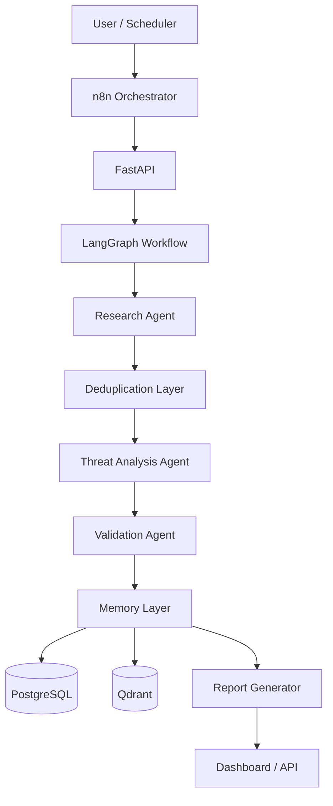
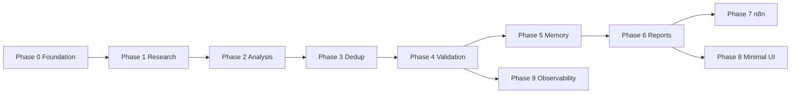

# CyberIntel Agent — Implementation Phases

Execution roadmap for v1. Sequencing is dependency-aware: each phase unlocks the next. **Do not build future phases while an earlier phase is incomplete.**

## North Star

The project is impressive because of **engineering judgment, memory, validation, orchestration, and reliability** — not because it uses LLMs.

### Core capabilities (in order of importance)

| Capability | Why it matters |
|------------|----------------|
| Validation Agent | Separates “LLM wrapper” from serious agentic system |
| Memory Layer | Enables smarter second investigation (the “agentic moment”) |
| Structured outputs | Every agent returns Pydantic schemas — no unvalidated free text |
| Hybrid architecture | n8n = triggers/scheduling only; Python + LangGraph = intelligence |
| Deep MVP | Fewer agents, more reliability, more engineering depth |

### Architecture (target state)



### MVP boundary (finish these; defer the rest)

| In MVP | Out of MVP (README only) |
|--------|--------------------------|
| Research Agent | MITRE ATT&CK mapping |
| Deduplication Layer | IOC correlation |
| Threat Analysis Agent | Autonomous SOC platform |
| Validation Agent | 10+ data sources |
| Memory Layer | Fancy UI / animations |
| Report Generator | Massive integrations |
| LangGraph orchestration | Self-healing agents |
| FastAPI | Human approval workflows |
| Basic n8n trigger | Slack alerts (later) |

### Signature demo (build toward this by end of Phase 5)

1. Run investigation on threat actor / CVE → store in memory.
2. Run related investigation later → system recalls prior context, escalates severity, skips redundant work.

That is the moment the system becomes **agentic**, not workflow automation.

---

## Phase dependency graph



Phases 7, 8, and 9 can overlap **after** Phase 6 is stable. Observability (9) should start wiring during Phase 2+ but is “complete” only once the graph is stable.

---

## Phase 0 — Architecture & Foundation

**Goal:** Correct project skeleton before any agent logic.

**Prerequisites:** None.

### Build

| Item | Detail |
|------|--------|
| Repository layout | `backend/` (agents, workflows, schemas, services, memory, validators, reports, api, core), `frontend/`, `n8n/`, `docs/`, `tests/` |
| Stack | FastAPI, LangGraph, Pydantic v2, PostgreSQL, Qdrant, Langfuse (stub OK), n8n (folder only) |
| Config | `.env.example`, settings module, logging |
| API | `POST /investigate`, `GET /health`, `GET /investigation/{id}` (stub handlers OK) |
| Base schemas | `ThreatResearch`, `ThreatAssessment`, `ValidationResult`, `InvestigationRecord` |
| Infra | `docker-compose.yml` for Postgres + Qdrant |

### Acceptance criteria

- [x] `docker compose up` starts Postgres and Qdrant
- [x] FastAPI serves `/health` with 200
- [x] All base Pydantic models import and validate sample JSON
- [x] LangGraph package installed; bootstrap graph compiles without error
- [x] README documents how to run locally

### Output

Clean repo, running API, DB connectivity, schemas defined, investigation endpoint accepts payload (may return placeholder).

**Estimated focus:** 1–2 sessions. No LLM calls required yet.

---

## Phase 1 — Research Agent

**Goal:** Autonomous threat intelligence retrieval with **strict structured output**.

**Prerequisites:** Phase 0.

### Build

| Item | Detail |
|------|--------|
| Input | CVE ID, malware family, or threat actor (start with CVE) |
| Sources (only two) | NVD API, CISA KEV |
| Output schema | `ThreatResearch`: `cve_id`, `summary`, `cvss_score`, `exploit_available`, `references`, `affected_products` |
| Tools | HTTP clients / tool nodes — no raw LLM prose as final artifact |

### Acceptance criteria

- [x] `POST /investigate` with `{"query": "CVE-2024-XXXX"}` returns validated `ThreatResearch`
- [x] CVSS and references come from NVD (or explicit null + uncertainty)
- [x] KEV listing reflected in `exploit_available` when applicable
- [x] Invalid CVE returns structured error, not stack trace to client

### Output

First **real** agent: tool usage, autonomous retrieval, Pydantic-only response body.

**Do not:** Add VirusTotal, Shodan, etc.

---

## Phase 2 — Threat Analysis Agent

**Goal:** Reasoning over research data with confidence and traceability.

**Prerequisites:** Phase 1.

### Build

| Item | Detail |
|------|--------|
| Output schema | `ThreatAssessment`: `severity`, `confidence`, `reasoning`, `remediation`, `uncertainty_notes` |
| Orchestration | LangGraph: state, nodes (research → analyze), retries, simple branching |
| Behavior | Attack path, impact, exploitability, remediation — grounded in `ThreatResearch` |

### Acceptance criteria

- [x] Graph runs research then analysis in one `/investigate` call
- [x] `confidence` is 0–100 integer with `uncertainty_notes` when data thin
- [x] `reasoning` cites fields from research (CVE, CVSS, KEV), not invented CVEs
- [x] Graph state persisted in memory for debugging (in-process OK for MVP)

### Output

Retrieve + reason + structured analysis. System starts feeling **agentic**.

---

## Phase 3 — Deduplication Layer

**Goal:** Engineering maturity — avoid redundant intelligence work.

**Prerequisites:** Phase 2 (needs stable research payloads).

### Build

| Item | Detail |
|------|--------|
| Techniques | SHA hash per investigation fingerprint, fuzzy match on titles/summaries, cosine similarity on embeddings (optional until Phase 5) |
| Behavior | Merge duplicate advisories, skip re-fetch when hash seen, flag near-duplicates |

### Acceptance criteria

- [ ] Same CVE investigated twice → second run detects duplicate and short-circuits or merges
- [ ] Dedup metadata attached to investigation record
- [ ] Unit tests for hash + fuzzy paths

### Output

Cleaner intelligence, less redundant API usage. High signal for recruiters.

---

## Phase 4 — Validation Agent (highest architectural signal)

**Goal:** Reliability and guardrails — **the** differentiator.

**Prerequisites:** Phase 2 (Phase 3 recommended but can run in parallel after 2).

### Build

| Item | Detail |
|------|--------|
| Checks | Hallucinated CVEs, unsupported exploit claims, CVSS mismatch vs NVD, missing citations, schema integrity |
| Output schema | `ValidationResult`: `valid`, `issues[]`, `confidence_adjustment`, `corrected_fields` (optional) |
| Graph | New node after analysis; fail or downgrade confidence on hard failures |

### Acceptance criteria

- [ ] If analysis claims public exploit but research has no exploit refs → `valid: false` with clear issue
- [ ] If CVSS in assessment disagrees with NVD beyond tolerance → flagged
- [ ] Valid investigations pass with `confidence_adjustment` documented
- [ ] Validation never returns unstructured text as API body

### Output

Self-checking system. Interview gold: show a deliberate bad claim caught by validation.

---

## Phase 5 — Memory Layer

**Goal:** Persistent context — **real** agentic behavior.

**Prerequisites:** Phase 4 (store only validated, structured outputs).

### Build

| Store | Contents |
|-------|----------|
| PostgreSQL | Investigations, scores, severity history, threat actor/CVE keys, validation outcomes |
| Qdrant | Embeddings of summaries + actor/CVE for semantic recall |

### Rules

- **Store:** confirmed findings, structured agent outputs, investigation metadata
- **Do not store:** raw prompts, raw LLM completions

### Acceptance criteria

- [ ] Investigation #1 for actor/CVE persisted after validation
- [ ] Investigation #2 for same entity retrieves prior record via API/memory service
- [ ] Severity escalation or skip logic when prior high-severity finding exists
- [ ] Demo script documented in `docs/DEMO.md`

### Output

**Agentic moment** — smarter second investigation.

---

## Phase 6 — Report Generator

**Goal:** Productization for demos and stakeholders.

**Prerequisites:** Phase 5.

### Build

| Section | Source |
|---------|--------|
| Executive summary | Assessment + validation |
| Technical analysis | Research + reasoning trace |
| Remediation | Assessment |
| Historical context | Memory recall |
| Export | Markdown (MVP); PDF/JSON later |

### Acceptance criteria

- [ ] Each completed investigation writes `investigation_report.md` (or path in response)
- [ ] Report includes confidence, validation status, and prior investigation references when present
- [ ] Report generated only from structured fields (template, not free-form LLM wall of text)

### Output

Demo-ready artifact for BreakoutAI-style presentations.

---

## Phase 7 — n8n Integration

**Goal:** Scheduling and triggers only — **not** intelligence logic.

**Prerequisites:** Phase 6 (stable `/investigate`).

### Build

| n8n does | n8n does not |
|----------|----------------|
| Cron (e.g. hourly CVE poll) | Reasoning |
| HTTP call to FastAPI | Validation |
| Notifications (email/webhook stub) | LangGraph state |

### Example flow

```
Schedule → Fetch new CVE list → POST /investigate → Wait → Notify / store report path
```

### Acceptance criteria

- [ ] Exported workflow JSON in `n8n/`
- [ ] Documented trigger for at least one automated investigation
- [ ] Failure path logs and does not silently drop

### Output

Operational, continuously active feel.

---

## Phase 8 — Minimal UI

**Goal:** Demo surface only.

**Prerequisites:** Phase 6 API stable.

### Build

- Recent investigations list
- Severity + confidence badges
- Link to report / markdown view
- Investigation detail page (id from API)

### Do not build

- Animations, design systems, auth (unless trivial), SOC war room UI

### Acceptance criteria

- [ ] UI reads from FastAPI only (no duplicate business logic in frontend)
- [ ] Can complete signature demo entirely from UI + API

---

## Phase 9 — Observability & Tracing

**Goal:** Professional operability — show full agent traces in interviews.

**Prerequisites:** LangGraph stable (Phase 2+); complete integration by Phase 4–6.

### Build

- Langfuse (or equivalent): spans per node, latency, token usage, retries
- Correlation id per investigation propagated through API → graph → DB

### Acceptance criteria

- [ ] One investigation visible end-to-end in Langfuse UI
- [ ] Failed validation or retry visible in trace

### Output

“Here is the complete agent execution trace” — powerful demo slide.

---

## Implementation order (strict)

| Order | Phase | Stop if incomplete |
|-------|-------|-------------------|
| 1 | 0 — Foundation | — |
| 2 | 1 — Research | No analysis without real research |
| 3 | 2 — Analysis + LangGraph | No validation without assessment |
| 4 | 3 — Dedup | Can ship MVP without, but do before memory at scale |
| 5 | 4 — Validation | **Required** before memory writes |
| 6 | 5 — Memory | Required for signature demo |
| 7 | 6 — Reports | Required for internship demo |
| 8 | 7 — n8n | Optional for first demo; required for “autonomous” story |
| 9 | 8 — UI | After reports |
| 10 | 9 — Observability | Wire early, finish late |

---

## Per-phase “definition of done” checklist (MVP)

When all are checked, v1 MVP is complete:

- [ ] Phase 0–6 acceptance criteria met
- [ ] Signature demo runs reproducibly (`docs/DEMO.md`)
- [ ] README lists future phases only as “not implemented”
- [ ] No agent returns unvalidated free-form text to API consumers
- [ ] Validation blocks or downgrades unsupported claims
- [ ] Second investigation recalls first from memory

---

## Future phases (document only — do not implement in v1)

- MITRE ATT&CK mapping
- IOC correlation engine
- Autonomous 24/7 monitoring mesh
- Slack / PagerDuty alerts
- Adversary profiling graphs
- Human-in-the-loop approval
- Diff alerts (what changed since last run)
- Self-healing agent recovery

---

## Next action

**Phase 2 is complete.** Start **Phase 3 — Deduplication Layer**.

When ready, say **“implement Phase 3”** and we execute that phase only—no parallel agent work.
